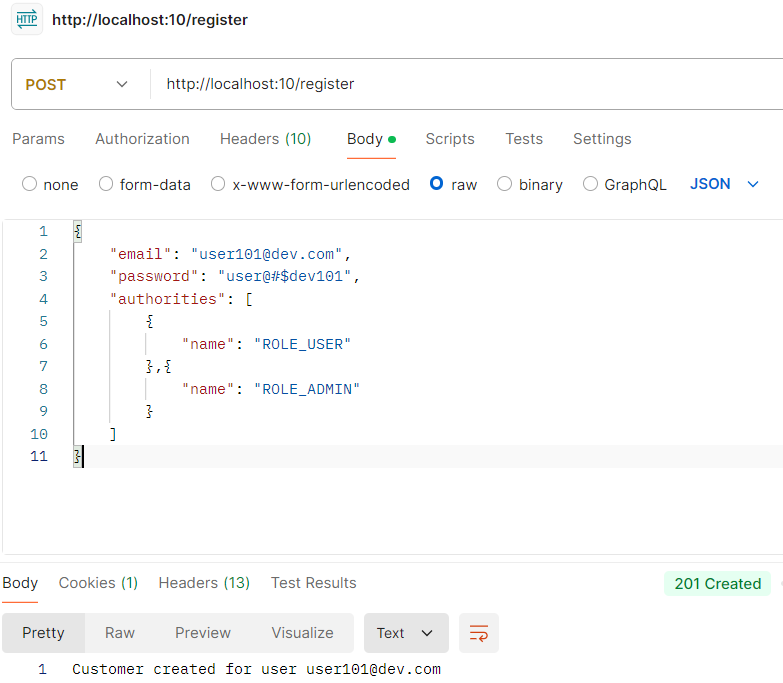
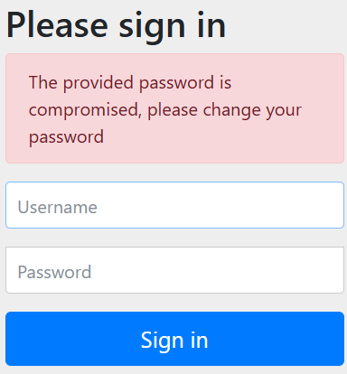

# SpringSecurity

This application for spring security.

> ## Work done till now
> > Currently, users are saved in h2-database files.
After creating my user, using the valid credential restricted endpoint can be accessed. 
Role based authentication is enabled. Also, authority based authentication part is commented out in the code. 
Event listeners are added to print logs for successful/failed authentication & authorization. 
JWT token based authentication enabled, and it generates token on endpoint **/apiLogin** with proper email and password. 
Method level filters are also in use.

> ## Endpoints
> > ### Application base URL
> > > http://localhost:10
> > ### Open endpoints
> > > /actuator, /open, /h2-console, /register, /apiLogin
> > ### Restricted endpoints
> > > /restricted, /restricted/admin, /restricted/user
> > ### Sample user register body 
> > > 
> > >  After this user creation restricted endpoint can be opened with valid credential (in this case user: user101@dev.com, password: user@#$dev101)

> ## If password is not strong, it will give error as 
> 